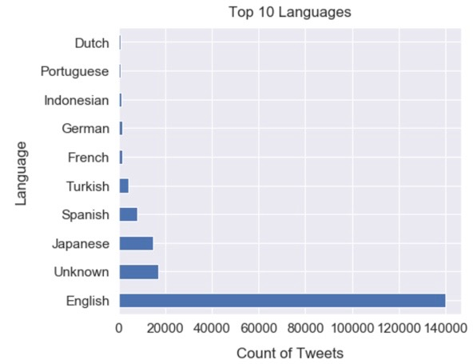
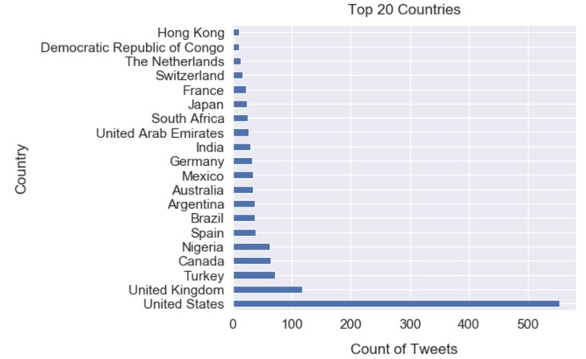
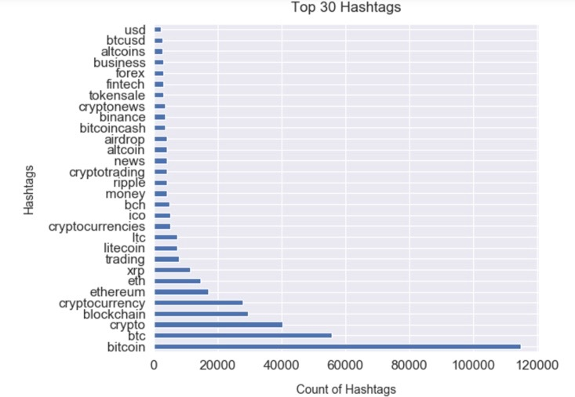
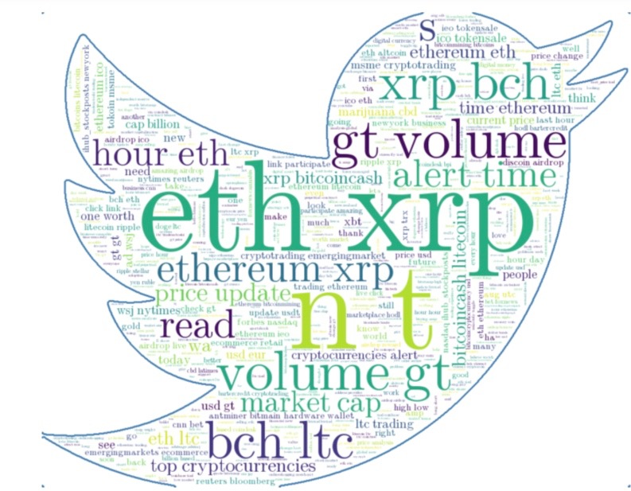
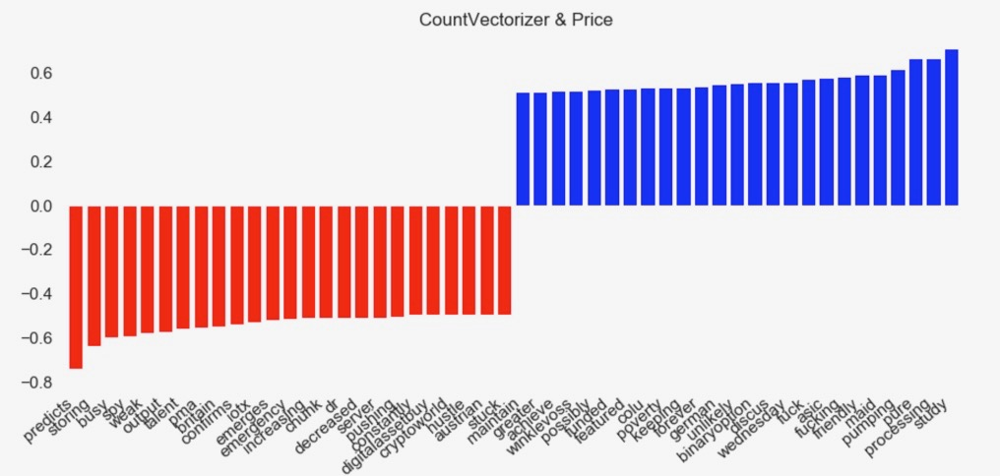
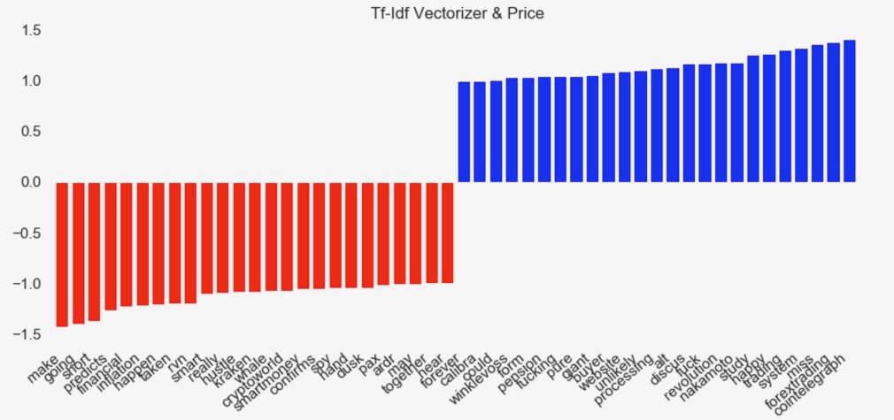

# Twitter Data Extraction and Analysis on BTC

Extract data from Twitter API, NLP, Sentiment Analysis, ML

## Introduction

This project is about the research and analysis project of social media data in bitcoin market. It demonstrates the following sections:1) introduction and background, 2) the detailed technical approaches, 3) results and discussion, 4) future work and conclusions.
The “Twitter Data Analysis on Bitcoin” project focused on the data research and analysis of Twitter data on bitcoin markets, to identify potential patterns and correlations for business insights. In the project, works were carried out in the discovery cycle including background research (identify the topics and related resources), preliminary data exploration (explore data and verify data quality), text cleaning (data cleaning and transformation), modeling and discussions.

## Background

Twitter data is the most comprehensive source of live, public conversation worldwide. Unlike other social platforms, almost every user’s tweets are completely public and pullable, which provides a large amount of data to run analytics on. Twitter data is also pretty detailed from time, content to location. Twitter’s API allows users to do complex queries like pulling every tweet about a certain topic within the past 7 days, or searching a certain topic by a list of search words.

Twitter’s REST, streaming, and Enterprise API enable programmatic analysis of data in real-time or back to the first Tweet in 2006. By performing the Twitter data analysis, it helps to get insight into audience, market movements, emerging trends, key topics, breaking news, and much more. With the twitter Search API, this project focused on 1) applying data science techniques on Twitter data to understand the motivations, interests, and attitudes of Twitter users about bitcoin market; 2) exploring the relationship between Twitter data and bitcoin market data to inform business decisions.

## Preliminary Data Analysis

The project mainly performed analysis on two datasets: Twitter dataset and Bitcoin market dataset. The Twitter dataset contains around 2 million records with 31 attributes, gathering all the tweets with keywords “bitcoin” or “btc” from 8/10/2019 to 8/25/2019 (15 days in total). The twitter data was collected through Twitter Search API with results in JSON format. The Twitter dataset contains informed attributes, like “created_at”, “full_text”, “retweet_count”, “favorited_count”, “lang”, “place”, etc. Part of the twitter dataset is shown below in Table 1, and the attributes we used in this project are summarized in Table 2.

Table 2 lists some column metrics of Table 1, and provides some basic information of each attribute.
  

The Bitcoin market dataset contains 21,600 records with 8 attributes, gathering btc market data in each minute from 8/10/2019 to 8/25/2019 (15 days in total). In this project, the “Close” price was used as the price for each minute when performing the analysis. Part of the btc market dataset is shown below in Table 3.

1) Top 10 Languages

From Figure 1(a), in addition to the “Unknown” language, the top 3 languages used most when users talking about bitcoin markets are “English”, “Japanese”, and “Spanish”, indicating that users who speaks these three languages are more interested in the bitcoin market.

2) Top 20 Countries/Areas

From Figure 1(b), the top 5 countries/areas are “United States”, “United Kingdom”, “Turkey”, “Canada”, and “Nigeria”, indicating that users in these five areas are probably more interested in the bitcoin market. What’s more, in the top 20 countries, we can see most countries are from North American and Europe, with some from Asia and Africa.

3) Top 30 Hashtags
 

 
From Figure 1(c), in addition to the words we used to search for the tweets (bitcoin,btc), the top 5 hashtags are “crypto”, “blockchain”, “crypto-currency”, “ethereum”, “eth” and “xrp”, indicating these words are most likely been attached with bitcoin market on Twitter. What’s more, in the top 30 hashtags, most tags are the cryptocurrency names.

## Text Cleaning

Before performing further analysis on text data, we need to clean the text for each tweet. From the “full_text” column in Table1, we can observe that there are emoji & emoticons, punctuations, upper case, links and numbers in the text.

To help the computer understand our text, we need to vectorize the text, which is just a method to convert words into long lists of numbers, which might hold some sort of complex structuring, only to be understood by a computer using some sort of machine learning, or data mining algorithm. But even before that, we need to perform a sequence of operations on the text, so that our text can be “cleaned” out. Main steps of text data cleansing are listed below with explanations:

1) Remove Emoji & Emoticons

In Figure 2(a), it shows the emoji and emoticons been removed. Although some emoji and emoticons can somewhat provide users attitudes, the sentiment analysis library we used here can only handle the limited built-in emoji and emoticons. Thus, we just simply remove them here.

2) Remove Punctuations

In Figure 2(b), it shows the punctuations been removed. In the following analysis, the model learns word embedding without considering order of words, and all the sentences will be tokenized as words. The punctuations were not necessary here, thus been removed.

3) Remove Stop Words and Search Words

In Figure 2(c), it shows the stop words and search words been removed. Some extremely common words which return vast amount of unnecessary information were excluded from the vocabulary entirely, because these words taking up unnecessary space or valuable processing time.

4) Other Operations

Other steps of text data cleansing are performed, including 1) lemmatization, 2) convert upper case to lower case, 3) remove links, 4) remove numbers. After the sequence of operations on the text, part of the cleaned text was shown below in Figure 3:

## Word Cloud
The word cloud on the left shows the top 600 frequent words/tokens appeared in all the text of twitter dataset. The bigger and the bolder a word appears in the word cloud, the more often this word appears in the text.

In Figure 4, it was observed that the most frequent words are “eth”, “xrp”, “gt”, “volume”, “bch”, “ltc”, etc. In all these words, expect “volume”, all other words are other cryptocurrency names. It seems like users on twitter always talking other cryptocurrencies along with btc. Among these cryptocurrency, “eth”, “xrp”, “gt”, “bch”, and “ltc” are relatively more popular than others.

Sentiment Analysis is the process of computationally determining whether a piece of writing is positive, negative or neutral, it helps us to understand the twitter users’ attitudes towards the bitcoin market. In the project, the NLTK-VADER library was applied on each tweet text to label its corresponding semantic orientation as either positive(>0), negative(<0), or neutral(=0).

1) Generate Sentiment Scores

VADER has been found to be quite successful when dealing with social media texts. It does not require any training data but a generalized standard sentiment lexicon, and returns the Positive(0~1), Neutral(0~1), Negative(0~1), and Compound(- 1~1) sentiment scores. The Positive, Negative and Neutral scores represent the proportion of text that falls in these categories. The Compound score is a metric that calculates the sum of all the lexicon ratings which have been normalized between -1(most extreme negative) and +1 (most extreme positive). Table 4 above shows part of the sentiment scores

2) Word Cloud by Sentiment

According to sentiment scores in Table 4, the twitter text data was divided into 3 groups: Positive, Neutral, and Negative. Generating the word clouds for 3 groups in Figure 5 to check the most frequent words used among twitter users with different attitudes:

[Figure 5. Word Cloud by Sentiment](Demo/13sentiment_wordcloud.jpg)

From Figure 5 above, we can observe that there is not a lot difference between Positive word cloud and Neutral word cloud – most words are cryptocurrency names. While in Negative word cloud, there appear a big “new” and “s”, which are probably good indicators for a negative tweet.

## Machine Learning Model: Twitter Text & BTC Price Change
With the processed data on-hand, this section focused on investigating the most frequent words associated with price change. As the BTC Market dataset is summarized every 1 minute, the twitter text data were also combined together for each minute. Comparing the current closing price with the last minute, the price change was labeled as “go up”(assigned as 1), or “go down”(assigned as 0). Then the LogisticRegression models are trained and tested, with text as input, price change as label. (Note: to handle time-series data, the train-test-split were not shuffled, and validated in time-order.)

Two approaches were applied when tokenizing and vectorizing the text: 1)Count Vectorizer and 2) Tf-Idf Vectorizer. They both convert the text data into vectors, but Count Vectorizer only counts the number of times a word appears in the document, while Tf-Idf Vectorizer also considers the overall document weightage of a word.

1) Count Vectorizer & BTC Price Change

Count Vectorizer implements both tokenization and count of occurrence which results in biasing in favor of most frequent words, this ends up in ignoring rare words which helps to process the data more efficiently. Fed the count vectorized data into LogisticRegression model then tested, the score was 0.5631. In Figure 6 below, 25 words with greatest absolute coefficients were listed.

The LogisticRegression Model assigned each word a coefficient, the value of which indicated the effect of that word for the bitcoin price change. For example, the leftmost word “study” had the greatest positive value, indicating the occurrence of this word most likely asscociated with the price “go up”. Even both good & bad words can be observed in “go up” and “go down” part, it also provided the words twitter users mostly likely to use along with price change in bitcoin.

2) Tf-Idf Vectorizer & BTC Price Change

In a corpus, several common words make up lots of space which carry little information, only the count of words will shallow the real interesting terms of the document. Tf-Idf Vectorizer penalize the frequency with how often they appear in the document. Fed the tf-idf vectorized data into LogisticRegression model then tested, the score was 0.6079, which was better than count vectorizer. In Figure 7 below, 25 words with greatest absolute coefficients were listed.

The LogisticRegression Model assigned each word a coefficient, the value of which indicated the effect of that word for the bitcoin price change. For example, the leftmost word “cointelegraph” had the greatest positive value, indicating the occurrence of this word most likely associated with the price “go up”. The tf-idf model gave a better test score than count model, and there were a lot of common words in two models, such as “study”, “happy”, “unlikely”......, which re-indicating the most frequent words associated with btc price change.

## Future Works & Conclusions
Social Media has already become a part of our daily life, it’s easy to know what other’s ideas and thoughts through social media. This project tried to investigate the relationship between twitter sentiment and volume with bitcoin market. Although there is no significant dependence been found between them, we did observe the correlation between the occurrence of certain words with the sentiment and bitcoin price change.

To further dive into the topic, some futures works can be considered to improve the results: 1) add emoji & emoticons in sentiment analysis; 2) build pipeline for real-time data collection and analysis; 3) expand the dataset from 15-days duration to several months, year level, etc.

## Reference
* _An Introduction to Text Mining using Twitter Streaming API and Python._ 21 July 2014, accessed 25 August 2019, http://adilmoujahid.com/posts/2014/07/twitter-analytics/.
* _Extracting Twitter Data, Pre-Processing and Sentiment Analysis using Python 3.0._ Apr 2019, accessed 25 August 2019, https://towardsdatascience.com/extracting-twitter-data-pre-processing-and- sentiment-analysis-using-python-3-0-7192bd8b47cf.
* _Analyzing Tweets with NLP in minutes with Spark, Optimus and Twint._ 5 May 2018, assessed accessed 25 August 2019, https://towardsdatascience.com/analyzing-tweets-with-nlp-in-minutes-with- spark-optimus-and-twint-a0c96084995f
